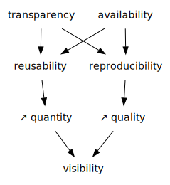

layout: true
  

  <table>
    <tr>
      <td style="text-align:right">Sächsische Landesbibliothek – Staats- und Universitätsbibliothek</td>
      <td>28.02.2022</td>
      <td style="text-align:right"><a href="https://www.slub-dresden.de/">www.slub-dresden.de</a></td>
    </tr>
    <tr>
      <td style="text-align:right">Referat 4.3</td>
      <td />
    </tr>
  </table>

  <table>
    <tr>
      <td style="text-align:left"><b>Kay-Michael Würzner</b></td>
    </tr>
    <tr>
      <td style="text-align:left">Referat 4.3</td>
    </tr>
    <tr>
      <td style="font-size:8pt"><b>28.02.2022</b></td>
    </tr>
    <tr>
      <td style="font-size:8pt">Hybrid Lab II</td>
    </tr>
  </table>

---

class: title-slide
count: false

# The SLUB Open Science Lab

---

# Why Open Science?

---

# Overview

1. Bundling of advisory and educational **services** to support an open research cycle
2. Attractive and modernly equipped work, event and meeting **place**
3. Centrally situated, university-wide **icon** for the importance of open science

---

class: part-slide
count: false

# Advisory and educational services

---

# Advisory and educational services

.cols[
.sixty[
- Support of an open scientific culture central part of
  [SLUB strategy](https://nbn-resolving.org/urn:nbn:de:bsz:14-qucosa2-357501)
    ]
.fourty[

]
]
- Services around an open research cycle
    * **Open Access**: Financing and licensing issues; publication infrastructure
    * **Open Data**: (Meta-)Data formats; repositories; technical workflows
    * **Open Methodology**: Pregistration and registered reports; Open Science Framework
    * **Open Evaluation**: Bibliometric analyses for optimized outreach and objective impact estimation

---

# Advisory and educational services

- Services in an openness ecosystem
    * **Open Educational Resources**: Methodology and tools; licensing issues
    * **Citizen Science**: Connecting professional and non-professional scientific contexts
    * **Open Science practices**: Advisory programme for Horizon Europe applications
    * **Science communication**: Scientific blogging; predatory journals; academic identity management

---

# Advisory and educational services

- **Talks**, e.g. at
    * International Open Access Week
    * Graduate Academy
    * Lessons in Open Science
- **Individual advice**, e.g. at
    * SLUB Knowledge Bar
    * Subject librarians
    * SLUB Helpdesk
- **Self-study materials** on
    * [YouTube](https://www.youtube.com/user/slubdresden)
    * [Opal](https://bildungsportal.sachsen.de/opal/auth/repository/catalog/548470806;jsessionid=1E37A405717942198827CEFF6E38A0D8.opalN5)

---

# Advisory and educational services

- In cooperation with academic partners at TUD (and beyond)
    * [Service Center Research Data](https://tu-dresden.de/forschung-transfer/services-fuer-forschende/kontaktstelle-forschungsdaten)
    * [Centre for Interdisciplinary Learning and Teaching (ZiLL)](https://tu-dresden.de/tu-dresden/organisation/rektorat/prorektor-bildung/zill)
    * [European Project Center](https://tu-dresden.de/forschung-transfer/services-fuer-forschende/european-project-center)
    * [Open Science Initiative](https://tu-dresden.de/mn/psychologie/die-fakultaet/open-science)
    * [SaxFDM](https://saxfdm.de/)
    * ...

---

class: part-slide
count: false

# Work, event and meeting place

---

# Work, event and meeting place

- Grand opening originally planned for 2020
- Interim at Zellescher Weg 21 (*zell21*)

.cols[
.fifty[

]
.fifty[

]
]

---

# Work, event and meeting place

.cols[
.fifty[
- Mixture of bookable and freely usable workplaces
- Three larger event rooms
    + OSL 1: up to 70 p.
    + OSL 2 & 3: up to 30 p.
    + Each with flexible furniture
- Open Science Desk
- Technical equipment for hybrid events
    + Projectors, digital whiteboards
    + Mobile cameras, microphones, speakers etc.
- **Kitchen**
]
.fifty[

]
]

---

class: part-slide
count: false

# Icon for the importance of Open Science

---

# Icon for the importance of Open Science

.cols[
.fifty[
- Free and unrestricted access to knowledge and information as a key factor for **equal opportunities** and **maximal scientific progress**
- Open Science is a worldwide movement
    * UNESCO: “human right to share in scientific advancement and its benefits”
    * [Recommendation on Open Science](https://www.unesco.org/en/natural-sciences/open-science)
]
.fifty[

]
]

---

# Icon for the importance of Open Science

---

# Many thanks for your attention!

- Contact: [openscience@slub-dresden.de](mailto:openscience@slub-dresden.de)
- More information: [OSL Blog](https://osl.hypotheses.org/)
- Save the date: 8th October 2022

<a href="https://wrznr.github.io/os-hybrid-lab-2022/">wrznr.github.io/os-hybrid-lab-2022</a>

